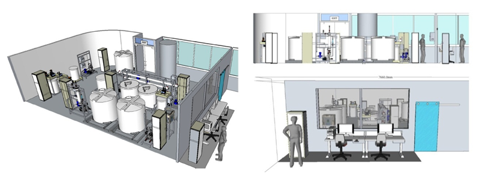

# Optimizing the Quantum Latent PCA Autoencoding Model (QLPAM) for Anomaly Detection on the SWaT Dataset
This repository contains experiments for my Industrial Ph.D. in Computational Intelligence, focusing on anomaly detection with the SWaT Dataset. I've implemented the Quantum Latent PCA Autoencoding Model (QLPAM), using PCA for encoding/decoding and a PQC in the latent space, optimized with Adaptive QAOA and classical/quantum genetic algorithms.

